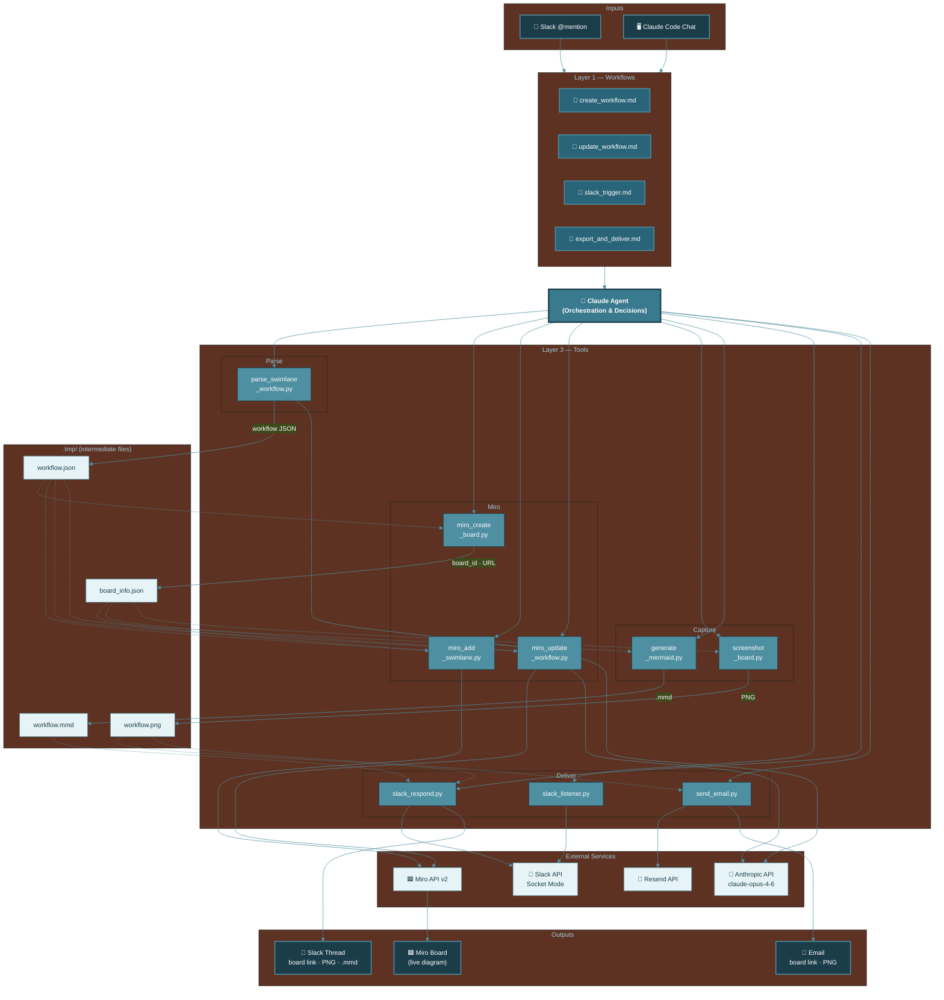

# WAT Workflow Agent — Architecture Diagram

## Legend

| Colour | Layer |
|--------|-------|
| Deep Navy `#1b3d4a` | Inputs & Outputs |
| Dark Teal `#2a6478` | Workflows (SOPs) |
| Button Blue `#3a7a8e` | Agent (Claude) |
| Medium Teal `#4e8fa2` | Tools (Python scripts) |
| Ice Blue `#e6f4f7` | External Services & Temp Files |
