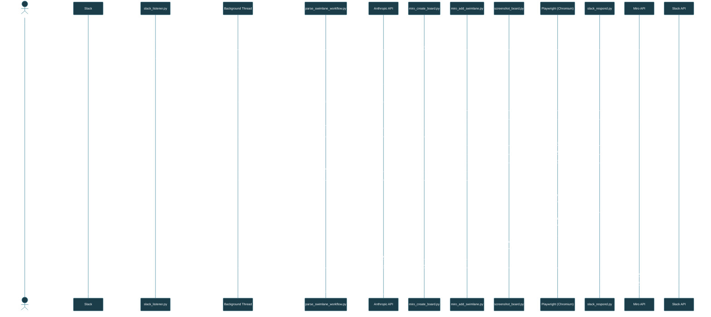
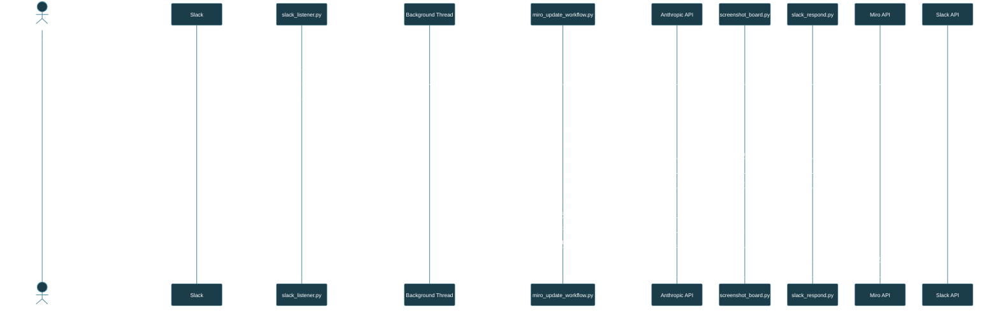
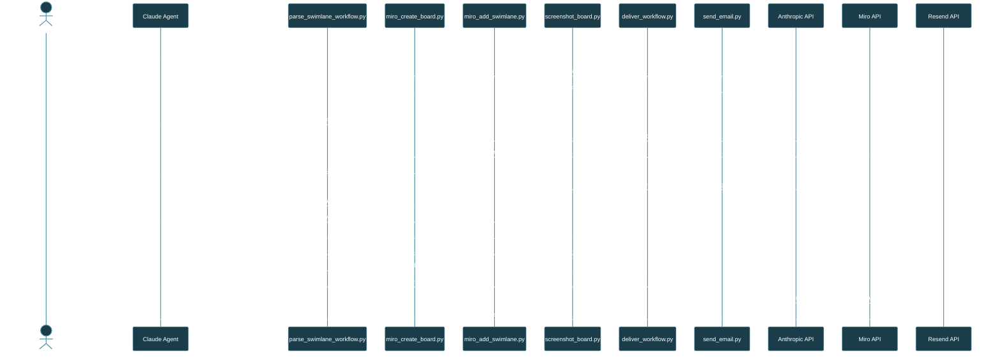

# WAT Workflow Agent — Sequence Diagram

## Slack Trigger Flow

```mermaid
%%{init: {
  "theme": "base",
  "themeVariables": {
    "background":           "#ffffff",
    "primaryColor":         "#1b3d4a",
    "primaryTextColor":     "#ffffff",
    "primaryBorderColor":   "#4e8fa2",
    "secondaryColor":       "#3a7a8e",
    "secondaryTextColor":   "#ffffff",
    "secondaryBorderColor": "#4e8fa2",
    "tertiaryColor":        "#2a6478",
    "tertiaryTextColor":    "#ffffff",
    "tertiaryBorderColor":  "#4e8fa2",
    "actorBkg":             "#1b3d4a",
    "actorBorder":          "#4e8fa2",
    "actorTextColor":       "#ffffff",
    "actorLineColor":       "#4e8fa2",
    "signalColor":          "#ffffff",
    "signalTextColor":      "#ffffff",
    "activationBkgColor":   "#4e8fa2",
    "activationBorderColor":"#1b3d4a",
    "noteBkgColor":         "#e6f4f7",
    "noteBorderColor":      "#4e8fa2",
    "noteTextColor":        "#ffffff",
    "loopTextColor":        "#ffffff",
    "labelBoxBkgColor":     "#3a7a8e",
    "labelBoxBorderColor":  "#4e8fa2",
    "labelTextColor":       "#ffffff",
    "sequenceNumberColor":  "#ffffff"
  }
}}%%
sequenceDiagram
    actor User
    participant Slack
    participant Listener as slack_listener.py
    participant Thread as Background Thread
    participant Parse as parse_swimlane_workflow.py
    participant Anthropic as Anthropic API
    participant MiroCreate as miro_create_board.py
    participant MiroRender as miro_add_swimlane.py
    participant Screenshot as screenshot_board.py
    participant Playwright as Playwright (Chromium)
    participant Respond as slack_respond.py
    participant MiroAPI as Miro API
    participant SlackAPI as Slack API

    User->>Slack: @Miro Workflow Agent <description>
    Slack->>Listener: app_mention event (Socket Mode)
    Listener->>Slack: SocketModeResponse (acknowledge <3s)
    Listener->>SlackAPI: chat_postMessage "Building your board..."
    Listener->>Thread: spawn daemon thread(description, channel, thread_ts)

    Thread->>Parse: subprocess parse_swimlane_workflow.py "<description>"
    Parse->>Anthropic: messages.create (claude-opus-4-6)
    Anthropic-->>Parse: swim lane workflow JSON
    Parse-->>Thread: .tmp/workflow.json

    Thread->>MiroCreate: subprocess miro_create_board.py "<title>"
    MiroCreate->>MiroAPI: POST /v2/boards
    MiroAPI-->>MiroCreate: board_id, board_url
    MiroCreate-->>Thread: .tmp/board_info.json

    Thread->>MiroRender: subprocess miro_add_swimlane.py
    MiroRender->>MiroAPI: POST /v2/boards/{id}/shapes (lanes + nodes)
    MiroRender->>MiroAPI: POST /v2/boards/{id}/connectors (edges)
    MiroRender->>MiroAPI: POST /v2/boards/{id}/images (logo)
    MiroRender-->>Thread: node_id_map saved to board_info.json

    Thread->>Screenshot: subprocess screenshot_board.py
    Screenshot->>Playwright: launch headless Chromium
    Playwright->>Playwright: login miro.com (email + password)
    Playwright->>MiroAPI: navigate to board_url
    Playwright->>Playwright: fit content (Ctrl+Shift+H), hide UI chrome
    Playwright-->>Screenshot: raw PNG
    Screenshot->>Screenshot: Pillow crop (strip toolbar/sidebar)
    Screenshot-->>Thread: .tmp/workflow.png

    Thread->>Respond: subprocess slack_respond.py <channel> <thread_ts>
    Respond->>SlackAPI: chat_postMessage (board link + summary)
    Respond->>SlackAPI: files_upload_v2 (workflow.png + workflow.mmd)
    SlackAPI-->>User: board link + PNG + Mermaid file in thread
```

## Update Flow (change request)J

```mermaid
%%{init: {
  "theme": "base",
  "themeVariables": {
    "background":           "#ffffff",
    "primaryColor":         "#1b3d4a",
    "primaryTextColor":     "#ffffff",
    "primaryBorderColor":   "#4e8fa2",
    "secondaryColor":       "#3a7a8e",
    "secondaryTextColor":   "#ffffff",
    "secondaryBorderColor": "#4e8fa2",
    "actorBkg":             "#1b3d4a",
    "actorBorder":          "#4e8fa2",
    "actorTextColor":       "#ffffff",
    "actorLineColor":       "#4e8fa2",
    "signalColor":          "#ffffff",
    "signalTextColor":      "#ffffff",
    "activationBkgColor":   "#4e8fa2",
    "activationBorderColor":"#1b3d4a",
    "noteBkgColor":         "#e6f4f7",
    "noteBorderColor":      "#4e8fa2",
    "noteTextColor":        "#2a6478",
    "labelBoxBkgColor":     "#3a7a8e",
    "labelBoxBorderColor":  "#4e8fa2",
    "labelTextColor":       "#ffffff"
  }
}}%%
sequenceDiagram
    actor User
    participant Slack
    participant Listener as slack_listener.py
    participant Thread as Background Thread
    participant Update as miro_update_workflow.py
    participant Anthropic as Anthropic API
    participant Screenshot as screenshot_board.py
    participant Respond as slack_respond.py
    participant MiroAPI as Miro API
    participant SlackAPI as Slack API

    User->>Slack: @Miro Workflow Agent add a review step between X and Y
    Slack->>Listener: app_mention event
    Listener->>Slack: SocketModeResponse (acknowledge)
    Listener->>SlackAPI: chat_postMessage "Building your board..."
    Listener->>Thread: spawn daemon thread (detected: update request)

    Thread->>Update: subprocess miro_update_workflow.py "<change>"
    Update->>Anthropic: interpret change request
    Anthropic-->>Update: targeted edits (add/remove/rename nodes)
    Update->>MiroAPI: DELETE old connectors
    Update->>MiroAPI: POST new shape
    Update->>MiroAPI: POST new connectors
    Update-->>Thread: .tmp/workflow.json + board_info.json updated

    Thread->>Screenshot: subprocess screenshot_board.py
    Screenshot-->>Thread: .tmp/workflow.png (updated)

    Thread->>Respond: subprocess slack_respond.py <channel> <thread_ts>
    Respond->>SlackAPI: chat_postMessage + files_upload_v2
    SlackAPI-->>User: updated board link + new PNG in thread
```

## Manual / Email Flow

```mermaid
%%{init: {
  "theme": "base",
  "themeVariables": {
    "background":           "#ffffff",
    "primaryColor":         "#1b3d4a",
    "primaryTextColor":     "#ffffff",
    "primaryBorderColor":   "#4e8fa2",
    "secondaryColor":       "#3a7a8e",
    "secondaryTextColor":   "#ffffff",
    "secondaryBorderColor": "#4e8fa2",
    "actorBkg":             "#1b3d4a",
    "actorBorder":          "#4e8fa2",
    "actorTextColor":       "#ffffff",
    "actorLineColor":       "#4e8fa2",
    "signalColor":          "#ffffff",
    "signalTextColor":      "#ffffff",
    "activationBkgColor":   "#4e8fa2",
    "activationBorderColor":"#1b3d4a",
    "noteBkgColor":         "#e6f4f7",
    "noteBorderColor":      "#4e8fa2",
    "noteTextColor":        "#2a6478",
    "labelBoxBkgColor":     "#3a7a8e",
    "labelBoxBorderColor":  "#4e8fa2",
    "labelTextColor":       "#ffffff"
  }
}}%%
sequenceDiagram
    actor User
    participant Agent as Claude Agent
    participant Parse as parse_swimlane_workflow.py
    participant MiroCreate as miro_create_board.py
    participant MiroRender as miro_add_swimlane.py
    participant Screenshot as screenshot_board.py
    participant Deliver as deliver_workflow.py
    participant Email as send_email.py
    participant Anthropic as Anthropic API
    participant MiroAPI as Miro API
    participant Resend as Resend API

    User->>Agent: describe process in Claude Code chat
    Agent->>Parse: python tools/parse_swimlane_workflow.py "<description>"
    Parse->>Anthropic: messages.create
    Anthropic-->>Parse: swim lane workflow JSON
    Parse-->>Agent: .tmp/workflow.json

    Agent->>MiroCreate: python tools/miro_create_board.py "<title>"
    MiroCreate->>MiroAPI: POST /v2/boards
    MiroAPI-->>Agent: .tmp/board_info.json

    Agent->>MiroRender: python tools/miro_add_swimlane.py
    MiroRender->>MiroAPI: lanes + nodes + connectors + logo
    MiroRender-->>Agent: board rendered

    Agent->>Screenshot: python tools/screenshot_board.py
    Screenshot-->>Agent: .tmp/workflow.png

    Agent->>Deliver: python tools/deliver_workflow.py
    Deliver-->>Agent: .tmp/deliver_payload.json

    Agent->>Email: python tools/send_email.py
    Email->>Resend: POST /emails (with base64 PNG attachment)
    Resend-->>User: email with board link + PNG
```
